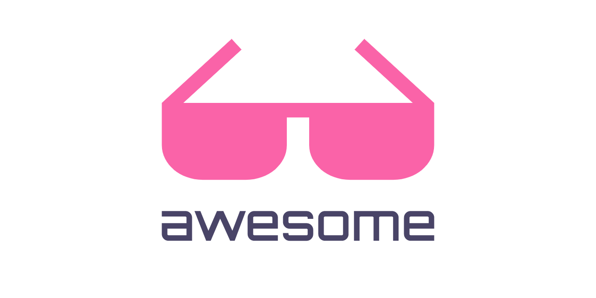

# [Awesome Web3Communities](https://github.com/devcraft1/awesome-web3-communities) 

**A curated list of awesome web3 communities.**

Your [contributions](contributing.md) are always welcome!

### Awesome Communities

## Ethereum

| Name                                 | Description                                                                     | Website                                                     | Discord/Twitter                                                                   | Region        | Country   |
| ------------------------------------ | ------------------------------------------------------------------------------- | ----------------------------------------------------------- | --------------------------------------------------------------------------------- | ------------- | --------- |
| Ethereum Africa                      | Community focused on Ethereum blockchain technology in Africa                   | [ethereumafrica.org](https://ethereumafrica.org/)           | [Discord](discord.gg/ethereum-africa), [Twitter](twitter.com/ethereumafrica)      | Africa        | -         |
| Web3 Asia                            | A hub for Web3 enthusiasts and developers in Asia                               | [web3asia.org](https://web3asia.org/)                       | [Discord](discord.gg/web3-asia), [Twitter](twitter.com/web3asia)                  | Asia          | -         |
| Europe Web3                          | Community dedicated to promoting and supporting Web3 initiatives in Europe      | [europeweb3.org](https://europeweb3.org/)                   | [Discord](discord.gg/europe-web3), [Twitter](twitter.com/europeweb3)              | Europe        | -         |
| North America Blockchain Association | Bringing together blockchain enthusiasts and professionals across North America | [nablockchain.org](https://nablockchain.org/)               | [Discord](discord.gg/nablockchain), [Twitter](twitter.com/nablockchain)           | North America | -         |
| South America Web3 Hub               | Connecting South American developers and users interested in Web3 technologies  | [southamericaweb3.org](https://southamericaweb3.org/)       | [Discord](discord.gg/south-america-web3), [Twitter](twitter.com/southamericaweb3) | South America | -         |
| Oceania Web3                         | A community fostering Web3 innovation and collaboration in Oceania              | [oceaniaweb3.org](https://oceaniaweb3.org/)                 | [Discord](discord.gg/oceania-web3), [Twitter](twitter.com/oceaniaweb3)            | Oceania       | -         |
| Blockchain Middle East               | Supporting blockchain adoption and innovation in the Middle East                | [blockchainme.org](https://blockchainme.org/)               | [Discord](discord.gg/blockchain-me), [Twitter](twitter.com/blockchainme)          | Middle East   | -         |
| Web3 India                           | Empowering the Indian Web3 ecosystem through education and collaboration        | [web3india.org](https://web3india.org/)                     | [Discord](discord.gg/web3-india), [Twitter](twitter.com/web3india)                | Asia          | India     |
| Blockchain Australia                 | Promoting blockchain technology and its applications in Australia               | [blockchainaustralia.org](https://blockchainaustralia.org/) | [Discord](discord.gg/blockchain-australia), [Twitter](twitter.com/blockchainau)   | Oceania       | Australia |

## Solana

| Name                                 | Description                                                                     | Website                                                     | Discord/Twitter                                                                   | Region        | Country   |
| ------------------------------------ | ------------------------------------------------------------------------------- | ----------------------------------------------------------- | --------------------------------------------------------------------------------- | ------------- | --------- |
| Ethereum Africa                      | Community focused on Ethereum blockchain technology in Africa                   | [ethereumafrica.org](https://ethereumafrica.org/)           | [Discord](discord.gg/ethereum-africa), [Twitter](twitter.com/ethereumafrica)      | Africa        | -         |
| Web3 Asia                            | A hub for Web3 enthusiasts and developers in Asia                               | [web3asia.org](https://web3asia.org/)                       | [Discord](discord.gg/web3-asia), [Twitter](twitter.com/web3asia)                  | Asia          | -         |
| Europe Web3                          | Community dedicated to promoting and supporting Web3 initiatives in Europe      | [europeweb3.org](https://europeweb3.org/)                   | [Discord](discord.gg/europe-web3), [Twitter](twitter.com/europeweb3)              | Europe        | -         |
| North America Blockchain Association | Bringing together blockchain enthusiasts and professionals across North America | [nablockchain.org](https://nablockchain.org/)               | [Discord](discord.gg/nablockchain), [Twitter](twitter.com/nablockchain)           | North America | -         |
| South America Web3 Hub               | Connecting South American developers and users interested in Web3 technologies  | [southamericaweb3.org](https://southamericaweb3.org/)       | [Discord](discord.gg/south-america-web3), [Twitter](twitter.com/southamericaweb3) | South America | -         |
| Oceania Web3                         | A community fostering Web3 innovation and collaboration in Oceania              | [oceaniaweb3.org](https://oceaniaweb3.org/)                 | [Discord](discord.gg/oceania-web3), [Twitter](twitter.com/oceaniaweb3)            | Oceania       | -         |
| Blockchain Middle East               | Supporting blockchain adoption and innovation in the Middle East                | [blockchainme.org](https://blockchainme.org/)               | [Discord](discord.gg/blockchain-me), [Twitter](twitter.com/blockchainme)          | Middle East   | -         |
| Web3 India                           | Empowering the Indian Web3 ecosystem through education and collaboration        | [web3india.org](https://web3india.org/)                     | [Discord](discord.gg/web3-india), [Twitter](twitter.com/web3india)                | Asia          | India     |
| Blockchain Australia                 | Promoting blockchain technology and its applications in Australia               | [blockchainaustralia.org](https://blockchainaustralia.org/) | [Discord](discord.gg/blockchain-australia), [Twitter](twitter.com/blockchainau)   | Oceania       | Australia |

## More?

Follow on your favorite social media to get daily updates on interesting GitHub repositories related to Security.

- Twitter : [@Web3Communities](https://twitter.com/web3Communities)
- Facebook : [Web3Communities](https://www.facebook.com/web3Communities)

## Contributions

Please have a look at [contributing.md](contributing.md).
